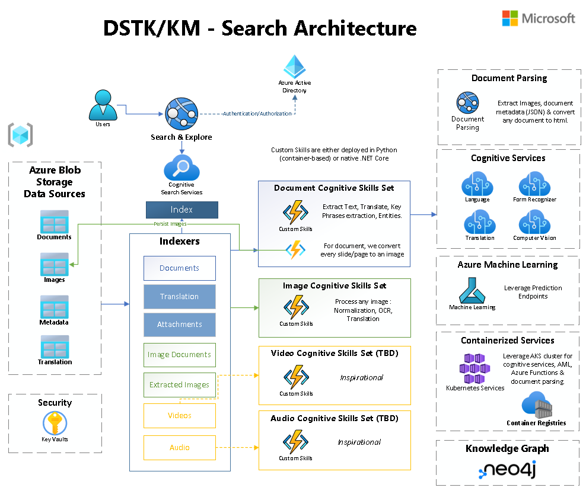

# Architecture 

General architecture diagram of this solution accelerator is as follows:

__List of architectural sub-systems__ 

- Data Sources 
- Data Orchestration (Optional)
- Azure Cognitive Search 
- Data Transformation / AI enrichment 
- Knowledge Store (Optional)
- Reporting & Analytics (Optional)
- Search & Exploration (UI)
- Monitoring & Instrumentation
- Security 

# Data Sources

Ingestion is based on Azure Storage Data Lake (ADLS2). The configured container for ingestion is **documents**. 

The two other containers namely **images** and **metadata** contains extracted data during the processing of documents. 

# Data Orchestration (Optional)

For more complex data orchestration, you can use any other data orchestration tool like Azure Data Factory to move or copy your unstructured corpus to the lake target container **documents**.
 
Amend the deployment script to deploy Azure Data Factory as part of your solution.

# Azure Cognitive Search (ACS)

A focus on the Search architecture. 

Audio and Video mentioned in the diagram are inspirational.

Please refer to the [Search documentation](../search/README.md) for more details.

# Data Transformation / AI Enrichment

All data transformation are done through Azure Functions (data processor) either written in C# or Python. You will notice that the solution doesn't use out of box skills for cognitive services. 

Some practical reasons for that decision are that OOTB Cognitive Skills

- Only support the Cognitive Service Bundle.
- No control of the model/version and latest options
- No preview possible
- No ability to manipulate the raw output (you would need another skill to do that)
- No control of scalability, performance & monitoring
- Can't be used outside ACS

We still use OOTB non-cognitive skills like TextSpliter or Merger
[AI enrichment in Azure Cognitive Search](https://docs.microsoft.com/en-us/azure/search/cognitive-search-concept-intro)

 Knowledge Store (Optional)

Knowledge store is a data sink created by a Cognitive Search AI enrichment pipeline that stores enriched content in tables and blob containers in Azure Storage for independent analysis or downstream processing in non-search scenarios, like knowledge mining.

[Knowledge Store Documentation](https://docs.microsoft.com/en-us/azure/search/knowledge-store-concept-intro?tabs=portal)

**No knowledge store is configured in our solution accelerator** 

# Reporting & Analytics (Optional) 

There is no dedicated reporting feature in this solution accelerator. All services reports metrics to Application Insights. You use it to create your own Reporting.  

# Search & Explore (UI)

Please refer to the [UI documentation](../ui/README.md) for more details.

# Monitoring

All deployed services are configured with Application Insights integration whenever possible. 

A single Application Insights holds all telemetry and monitoring data.

Please refer to the [Monitoring](../monitoring//README.md) for more details.

# Security

## UI Authentication 

The solution supports Azure App Service built-in AAD Authentication. 

## Credentials 

Key Vault is used to store all keys and connection strings. All Application settings are set with key vaults references. 

## Search Security Trimming 

The solution provides one Search security trimming option to secure content based on their location.

Please refer to the [Search documentation](../search/README.md) for mode details.

## Managed Identities 

All services -whenever available- are set with System-Managed identity. However assigning roles is often not possible due to internal azure policies, thus the solution still relies on connection strings. 

You may amend the solution to configure the MI roles in all services. 

# Azure Functions error handling and retries

Handling errors in Azure Functions is important to avoid lost data, missed events, and to monitor the health of your application. It's also important to understand the retry behaviors of event-based triggers.

[Documentation Azure Functions error handling and retries](https://docs.microsoft.com/en-us/azure/azure-functions/functions-bindings-error-pages)

