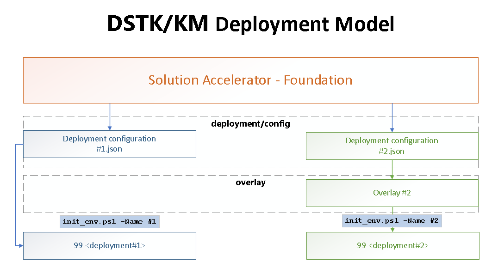

# Deployment

This knowledge mining solution accelerator deployment is done through the execution of PowerShell scripts. 

# Concept

With this solution accelerator, we introduced here the concept of environment and overlay to describe a deployment instance.

- **Environment** : single configuration file to configure your target Azure resources
- **Overlay** : Optional directory containing overlay of the base configuration.  



# Key Benefits 
- Use a single knowledge mining solution code-base
- Configure and Customize multiple environments through overlays
- Deploy and Operate multiple environments from one place
- Package environments to deploy in secured environment 

# ARM Template 

Given the complexity of dependencies between services i.e. Services Keys, function urls with authentication code, ARM template wasn't the best fit for deploying our solution accelerator. 

We chose the combination AZ CLI & PowerShell to help you deploy and operate your solution in a more interactive way rather than declarative. 

In the future, we might consider (Bicep) for declarative deployment though [https://docs.microsoft.com/en-us/azure/azure-resource-manager/bicep/overview?tabs=bicep] 

# Packaged solution

## Create an environment package

When creating a new environment, all resources required for deployment and publishing are stored in a dedicated folder with a 99- prefix.

This particular structure allows you to zip that entire folder, copied over your target environment and deploy from there. The below command will do that for you. 

```ps
Publish-Solution
```
## No direct access to the target environment

If you don't have a direct access to the target environment and no DevOps available either, assuming you only have access through the Azure Portal, you could use the Azure Cloud Shell to deploy the solution. 

- Upload the environment zip to your Cloud Shell Storage
- Unzip it
- Go to the environment root directory
- Initialize your environment 

```ps
.\init_env.ps1
```

**Idea** You could push all your environments releases to Cloud Shell storage to streamline your solution operations.

PowerShell Core & AZ CLI are already pre-installed in Azure Cloud Shell. 

# Re-deploying the same solution 

Soft-deletion is now default on Key Vaults and Azure Cognitive Services. If you wish to redeploy a solution with the same name and have previously deleted all services in the target resource group, you need to recover manually those services as follows

```ps
az keyvault recover --subscription $config.subscriptionId -n $params.keyvault

az cognitiveservices account recover -l $config.location -g $config.resourceGroupName -n $params.cogSvcXXXX
```

# Others considerations

Re-Configuring services post-deployment that are set under a VNET is challenging because the Azure Portal wouldn't allow you to do so much nor you could deploy against your customer environment from a public origin.

Therefore, the only option you have is PowerShell + az cli scripts that could be exceuted from a Bastion VM or Azure Cloud Shell.

Our accelerator provides PS modules to deploy, configure, test, operate services whether they are under a Virtual Network or not. 


# Continuous Integration & Continuous Deployment (CI/CD)

An Azure pipeline (YAML) is provided for CI/CD purpose. The pipeline is re-using the same deployment scripts to ease the maintenance & operations. 

```yaml
# Starter pipeline
# Start with a minimal pipeline that you can customize to build and deploy your code.
# Add steps that build, run tests, deploy, and more:
# https://aka.ms/yaml

trigger:
  branches:
    include:
      - main

variables:
  - name: tag
    value: '$(Build.BuildId)'
  - name: buildConfiguration
    value: Release
  - name: vmImageName
    value: 'windows-latest'
  - ${{ if eq(variables['build.SourceBranchName'], 'dev') }}:
    - group: contoso-group

stages:
  - stage: Build_Docker_Images
    displayName: Build Docker Images
    jobs:
    - job: Build
      displayName: Contoso DEV Docker Images
      pool:
        vmImage: $(vmImageName)
      steps:
      - checkout: self
        lfs: true
      - task: UseDotNet@2
        inputs:
          packageType: 'sdk'
          version: '6.0.x'
      - task: FuncToolsInstaller@0
        inputs:
          version: 'latest'
      - task: UsePythonVersion@0
        inputs:
          versionSpec: '3.9' 
          addToPath: true 
          architecture: 'x64' # Options: x86, x64 (this argument applies only on Windows agents)
      - task: AzureCLI@2
        displayName: 'Build All Docker Images'
        inputs:
          azureSubscription: '$(serviceConnectionName)'
          scriptType: 'pscore'
          scriptLocation: 'scriptPath'
          scriptPath: '$(Build.SourcesDirectory)/deployment/scripts/21_Build_DockerImages.ps1'
          arguments: '-EnvironmentName "$(environment)"'

  - stage: Build_Skills
    displayName: Build & Publish Functions
    jobs:
    - job: Build
      displayName: Build Functions
      pool:
        vmImage: $(vmImageName)
      steps:
      - checkout: self
        lfs: true
      - task: UseDotNet@2
        inputs:
          packageType: 'sdk'
          version: '6.0.x'
      - task: FuncToolsInstaller@0
        inputs:
          version: 'latest'
      - task: UsePythonVersion@0
        inputs:
          versionSpec: '3.9' 
          addToPath: true 
          architecture: 'x64' # Options: x86, x64 (this argument applies only on Windows agents)
      - task: AzureCLI@2
        displayName: 'Get Services Keys'
        inputs:
          azureSubscription: '$(serviceConnectionName)'
          scriptType: 'pscore'
          scriptLocation: 'scriptPath'
          scriptPath: '$(Build.SourcesDirectory)/deployment/scripts/15_Get_Services_Keys.ps1'
          arguments: '-EnvironmentName "$(environment)"'
      - task: AzureCLI@2
        displayName: 'Build & Deploy all functions Linux & Windows'
        inputs:
          azureSubscription: '$(serviceConnectionName)'
          scriptType: 'pscore'
          scriptLocation: 'scriptPath'
          scriptPath: '$(Build.SourcesDirectory)/deployment/scripts/20_Deploy_Functions.ps1'
          arguments: '-EnvironmentName "$(environment)" '

  - stage: Build_WebApps
    displayName: Contoso DEV WebApp(s)
    jobs:
    - job: Build
      displayName: Contoso DEV WebApp(s)
      pool:
        vmImage: $(vmImageName)
      steps:
      - checkout: self
        lfs: true
      - task: UseDotNet@2
        inputs:
          packageType: 'sdk'
          version: '6.0.x'
      - task: AzureCLI@2
        displayName: 'Get Services Keys'
        inputs:
          azureSubscription: '$(serviceConnectionName)'
          scriptType: 'pscore'
          scriptLocation: 'scriptPath'
          scriptPath: '$(Build.SourcesDirectory)/deployment/scripts/15_Get_Services_Keys.ps1'
          arguments: '-EnvironmentName "$(environment)"'
      - task: AzureCLI@2
        displayName: 'Build & Deploy all WebApps Linux & Windows'
        inputs:
          connectedServiceNameARM: $(serviceConnectionName)
          scriptType: pscore
          scriptLocation: scriptPath
          scriptPath: '$(Build.SourcesDirectory)/deployment/scripts/30_Deploy_WebApps.ps1'
          scriptArguments: '-EnvironmentName "$(environment)"'

  - stage: Configure_Solution
    displayName: Contoso DEV Configure & Restart
    jobs:
    - job: Configure
      displayName: Contoso DEV Configure
      pool:
        vmImage: $(vmImageName)
      steps:
      - task: AzureCLI@2
        displayName: 'Get Services Keys'
        inputs:
          azureSubscription: '$(serviceConnectionName)'
          scriptType: 'pscore'
          scriptLocation: 'scriptPath'
          scriptPath: '$(Build.SourcesDirectory)/deployment/scripts/15_Get_Services_Keys.ps1'
          arguments: '-EnvironmentName "$(environment)"'
      - task: AzureCLI@2
        displayName: 'Configure Azure Cognitive Search'
        inputs:
          connectedServiceNameARM: $(serviceConnectionName)
          scriptType: pscore
          scriptLocation: scriptPath
          scriptPath: '$(Build.SourcesDirectory)/deployment/scripts/40_Initialize_Search.ps1'
          scriptArguments: '-EnvironmentName "$(environment)"'
      - task: AzureCLI@2
        displayName: 'Restart the solution'
        inputs:
          connectedServiceNameARM: $(serviceConnectionName)
          scriptType: pscore
          scriptLocation: scriptPath
          scriptPath: '$(Build.SourcesDirectory)/deployment/scripts/50_Restart_Solution.ps1'
          scriptArguments: '-EnvironmentName "$(environment)"'

```

Carefully review your deployment in Production environment(s). Deploying functions (i.e. app settings) will bring down your services for a short period of time. 

We would advise to create new pipelines with specific triggers for UI updates only vs Search Enrichment or configuration. 

More information on [Azure DevOps Triggers](https://docs.microsoft.com/en-us/azure/devops/pipelines/yaml-schema/trigger?view=azure-pipelines#trigger-batch-branches-paths-tags)

# Operations

This **init_env.ps1** script is initializing your solution environment by loading a **core** powershell module & sourcing its configuration and parameters. 

Once loaded, you can operate the solution through pre-defined powershell cmdlets. 

Please refer to the [Operations documentation](../operations/README.md)
