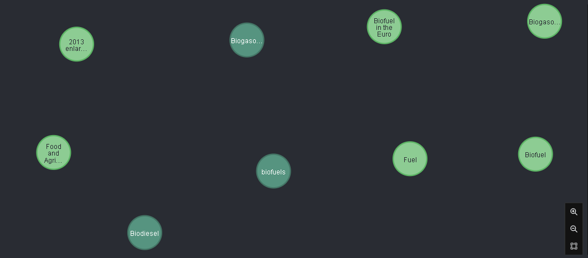
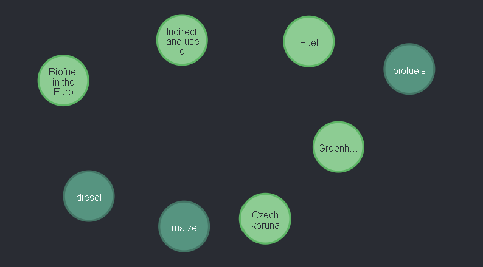

# Knowledge Mining & Graph

Mining value out of unstructured data without extracting relatioships or content connections would not be the same...

Our solution includes an example of integration with Neo4j Community edition to create a knowledge graph based on Named and Linked Entities Extraction.

The concept and pipeline is as follows:
- Extract Named Entities and Linked Entities.
- Easy to include your custom entities as well.
- Deduplicate and create basic references relationships
- Push to the Neo4j backend.

A single function app demonstrate how to interact with Neo4j instance to populate that knowledge graph.

We recommend the following readings to demonstrate different types of Relationships Extraction (RE)
[Different ways of doing Relation Extraction from text](https://medium.com/@andreasherman/different-ways-of-doing-relation-extraction-from-text-7362b4c3169e)
[From Text to a Knowledge Graph: The Information Extraction Pipeline](https://neo4j.com/blog/text-to-knowledge-graph-information-extraction-pipeline/)

# Cipher queries

```
MATCH (n) DETACH DELETE n
MATCH p=(n:Document) -[r:LINKED]->() WHERE r.strength > 5 RETURN p LIMIT 50 
MATCH p=(n:Organization)<-[]-(o:Document) RETURN p LIMIT 25
MATCH p=(n:Product)<-[]-(o:Document) RETURN p LIMIT 25
MATCH p=(n:Skill)<-[]-(o:Document) RETURN p LIMIT 25
```
## Document - Embedded relationships (i.e. attachments)

```
MATCH p=(n:Document) <-[:PARENT]- () RETURN p LIMIT 25
```

## Multiple hops and relationships inferrence by co-occurence

The multiple hops goal is to skip document, page, slide as content container to highlight potential entities connections. 

```cypher
MATCH p=(n:Entity)<-[r:LINKED]-()-[s:REFERENCES]-(k:Product) WHERE r.strength > 40 AND s.count > 3 RETURN k,n
```

The -()- allows to skip the document,page and slide nodes.



Another question - within all pages, what Entity and Product occurs simultaneously with strength ?

```cypher
MATCH p=(n:Entity)<-[r:LINKED]-(:Page)-[s:REFERENCES]->(k:Product) WHERE r.strength > 5 AND s.count > 3 RETURN k,n
```



Can we infer that the resulted products are linked to those Entities?

# Skill and Product

```
MATCH p=(n:Skill)-[r:REFERENCES]-(:Page)-[s:REFERENCES]-(k:Product) WHERE r.count > 1 AND s.count > 1 RETURN k,n
```

# Graph-related ressources

[Neo4j](https://neo4j.com)

[Stardog](https://www.stardog.com/)
