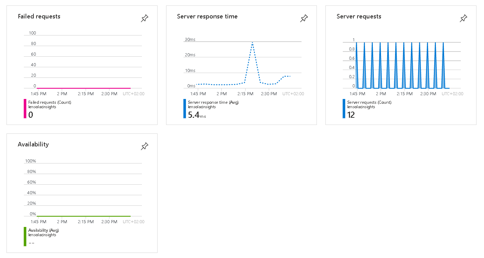

# Monitoring

Our solution accelerator components including the UI are monitored with Azure Application Insights. 

## Azure Application Insights

Application Insights is a feature of Azure Monitor that provides extensible application performance management (APM) and monitoring for live web apps. Developers and DevOps professionals can use Application Insights to:

Automatically detect performance anomalies.
Help diagnose issues by using powerful analytics tools.
See what users actually do with apps.
Help continuously improve app performance and usability.
Application Insights:

Supports a wide variety of platforms, including .NET, Node.js, Java, and Python.
Works for apps hosted on-premises, hybrid, or on any public cloud.
Integrates with DevOps processes.
Has connection points to many development tools.
Can monitor and analyze telemetry from mobile apps by integrating with Visual Studio App Center.

Learn more on [Application Insights](https://docs.microsoft.com/en-us/azure/azure-monitor/app/app-insights-overview)