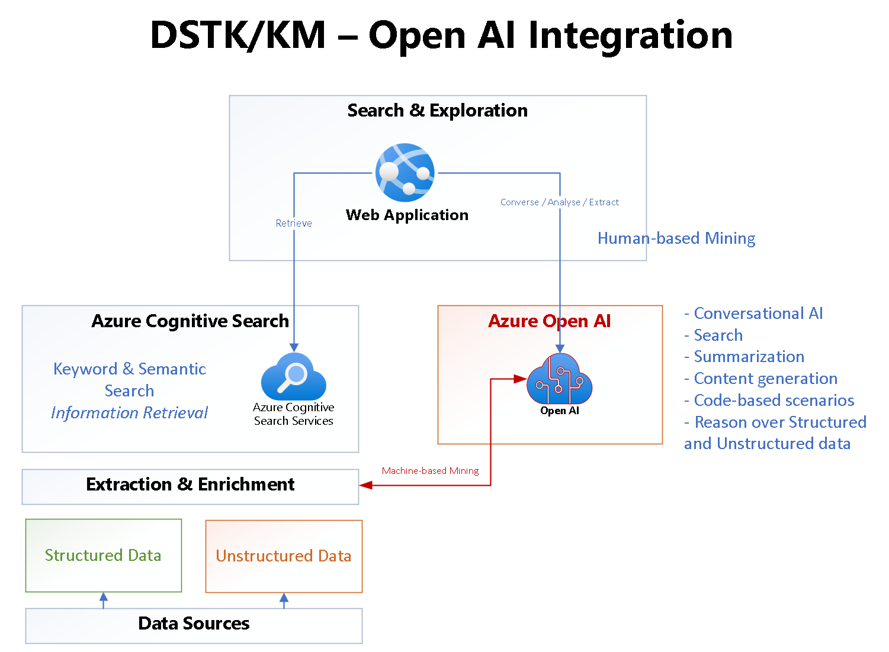

# Open AI in Knowledge Mining

Open AI is reshaping the entire industry. This is especially true for the knowledge mining workload.

While Azure Cognitive Search support keyword and semantic search, going beyond the simple list of results is not sufficient anymore. Open AI brings new set of capabilities ...

If you ask ChatGPT about possible use cases.  

```
GPT-3, or Generative Pretrained Transformer 3, is a powerful natural language processing model developed by OpenAI. It has a wide range of use cases and can be used in a variety of applications. Some of the best use cases for GPT-3 include:

**Natural language generation**: GPT-3 can be used to generate text that is similar to human writing, making it a useful tool for generating reports, summaries, and other types of text.

**Chatbots**: GPT-3 can be used to create conversational agents that can understand and respond to natural language input. This makes it a useful tool for customer service, support, and other applications where users need to interact with a computer in a conversational way.

**Question-answering**: GPT-3 can be used to answer questions posed in natural language, making it a useful tool for knowledge management, research, and other applications where users need to quickly find answers to their questions.

**Text classification**: GPT-3 can be used to classify text into different categories, such as sentiment analysis, topic classification, and spam detection.

**Language translation**: GPT-3 can be used to translate text from one language to another, making it a useful tool for multilingual applications and websites.

These are just a few examples of the many use cases for GPT-3. Its versatility and ability to generate human-like text make it a useful tool for many different applications.
```

Open AI Text & Code models scenarios include the below items: 
- Conversational AI
- Search
- Summarization 
- Writing Assistance or content generation 
- Code-based scenarios
- Reason over Structured and Unstructured data

So how about integrating chatGT into a Knowledge Mining ? 

The below scenarios are highly relevant for dealing with structure and unstructured data exploration and retrieval. 

# Open AI & Knowledge Exploration

## Natual Language Query transliteration

Asking natural language queries which are then converted into meaningful search queries is extremely powerful.

**Prompt**
```
Can you formulate a SQL query for the below request: 
Show me documents from Nicolas over the past week
```
**Response**
```sql
SELECT *
FROM documents
WHERE user = 'Nicolas'
AND created_at >= DATEADD(day, -7, GETDATE());
```
but what about Azure Cognitive Search ?

**Prompt**
```
Can you formulate a Lucene query for the below request: 
Show me documents from Nicolas over the past week
```
**Response**

```lucene
+user:"Nicolas" +created_at:[now-7d TO now]
```
the syntax is really good and consistent with Apache Lucence https://lucene.apache.org/core/2_9_4/queryparsersyntax.html although to integrate with Azure Cognitive Search the range piece need to be transliterate to the $filter expression. 

(Azure Cognitive Search Lucene Query Syntax)[https://learn.microsoft.com/en-us/azure/search/query-lucene-syntax]
Much of the Lucene Query Parser syntax is implemented intact in Azure Cognitive Search, except for *range searches, which are constructed through $filter expressions.

## Open AI & Knowledge Extraction 

## Entities Extraction 

Because Language Models are able to understand semantic, you can leverage them to extract entities.

**Prompt**
```
Can you extract named entities from the below sentence:
Michelle Yeoh became the first Asian woman to win best actress, as Everything Everywhere All at Once dominated at the Oscars.

The dazzling multiverse adventure won seven awards including best picture, director and original screenplay.

Accepting her statuette, Yeoh said: "For all the little boys and girls who look like me watching tonight, this is a beacon of hope and possibilities.

"And ladies, don't let anybody tell you that you are ever past your prime."

Yeoh's co-stars Ke Huy Quan and Jamie Lee Curtis triumphed in the supporting actor and actress categories. In the history of the Oscars, no other film has ever won best picture, best director and three acting prizes.
```
**Response** 
```
Yes, I can extract named entities from the given sentence. Here are the named entities:

Michelle Yeoh: Person
Asian: Nationality
Everything Everywhere All at Once: Movie title
Oscars: Event
Ke Huy Quan: Person
Jamie Lee Curtis: Person
```

by changing the prompt to ask for a specific output format e.g. JSON 

**Prompt**
```
...Can you extract named entities as JSON from the below sentence...
```
**Response**
```json
{
  "PERSON": [
    "Michelle Yeoh",
    "Ke Huy Quan",
    "Jamie Lee Curtis"
  ],
  "NORP": [
    "Asian"
  ],
  "EVENT": [
    "the Oscars"
  ],
  "DATE": [
    "tonight"
  ],
  "ORG": [
    "Everything Everywhere All at Once"
  ],
  "ORDINAL": [
    "first",
    "seven",
    "best picture",
    "best director",
    "original screenplay",
    "supporting actor",
    "supporting actress"
  ]
}
```
Still some glitches (ORG) but you get actionable well-formatted data ! 

## Summarization 

While Azure Cognitive Search support keyword and semantic search, a simple list of results is not sufficient anymore. Open AI brings new capabilities like abstractive summarization.

## Interactive Document Chat

Once you set your eyes on a document i.e. report, you could enable an interactive mode for a nice question-answering or reasonning feature. 

Asking questions to a particular document, manually mining information or knowledge gives the end-users the power to control part of the mining process. 


AI + People better together. 

## Interactive Chat with your entire data corpus

By far, the most advanced & compelling scenario is the ability to fine-trained Open AI models with your own data...

## Open AI enabled Knowledge Mining Architecture 



# Resources

[Azure OpenAI Service](https://learn.microsoft.com/en-us/azure/cognitive-services/openai/quickstart?pivots=programming-language-python)

[Revolutionize your Enterprise Data with ChatGPT Next-gen Apps with Azure OpenAI and Cognitive Search](https://techcommunity.microsoft.com/t5/ai-applied-ai-blog/revolutionize-your-enterprise-data-with-chatgpt-next-gen-apps-w/ba-p/3762087)

[Azure Cognitive Search](https://learn.microsoft.com/azure/search/search-what-is-azure-search)

[github - ChatGPT + Enterprise data with Azure OpenAI and Cognitive Search](https://github.com/Azure-Samples/azure-search-openai-demo)
