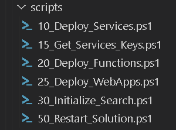

# Operations

Our solution accelerator ships very useful PowerShell cmdlets & scripts to deploy or operate your solution.   

## Deployment Scripts 



All scripts are using a set of cmdlets defined in two modules.  
-core : cmdlets to deploy, operate & monitor your solution
-vnet : ad-hoc cmdlets to support a VNET deployment

The __init_env.ps1__ is loading those two modules at startup. 

The list of all cmdlets can be done via the below command 
```ps
get-command -Module core
```
__Example of cmdlets__
| Command | Description |
|--|--|
| Initialize-Search | Push the entire search configuration to Azure Cognitive Search| 
| Start-SearchIndexer | Start all indexers |
| Reset-SearchIndexer | Reset all indexers |

## **Core** PowerShell module

Validate the core and vnet modules are loaded in your PS session. 

```ps
get-module | ft -Property Name,ExportedCommands
```

```ps
Name                            ExportedCommands
----                            ----------------
core                            {[Add-BlobRetryTag, Add-BlobRetryTag], [Add-ExtendedParameters, Add-ExtendedParameters], [Add-KeyVaultFunctionsPolicies, Add-KeyVaultFunct…
Microsoft.PowerShell.Management {[Add-Content, Add-Content], [Clear-Content, Clear-Content], [Clear-Item, Clear-Item], [Clear-ItemProperty, Clear-ItemProperty]…}
Microsoft.PowerShell.Utility    {[Add-Member, Add-Member], [Add-Type, Add-Type], [Clear-Variable, Clear-Variable], [Compare-Object, Compare-Object]…}
PSReadLine                      {[Get-PSReadLineKeyHandler, Get-PSReadLineKeyHandler], [Get-PSReadLineOption, Get-PSReadLineOption], [Remove-PSReadLineKeyHandler, Remove-…
vnet                            {[Add-CognitiveSearchIps, Add-CognitiveSearchIps], [Add-CognitiveSearchIpsToGateway, Add-CognitiveSearchIpsToGateway], [Add-CognitiveServi…

```

To list of all available commands from the **core** module 

```ps
Get-Command -Module core | ft -Property Name,Version,Source
```

```bash
Name                              Version Source
----                              ------- ------
Add-BlobRetryTag                  0.0     core
Add-ExtendedParameters            0.0     core
Add-KeyVaultFunctionsPolicies     0.0     core
Add-KeyVaultSecrets               0.0     core
Add-KeyVaultWebAppsPolicies       0.0     core
Add-Param                         0.0     core
Add-ServicesParameters            0.0     core
Build-DockerImages                0.0     core
Build-Functions                   0.0     core
Build-Solution                    0.0     core
Build-WebApps                     0.0     core
Compress-Release                  0.0     core
Get-AllServicesKeys               0.0     core
Get-AppInsightsInstrumentationKey 0.0     core
Get-AzureFunctionFiles            0.0     core
Get-AzureFunctionFolders          0.0     core
Get-AzureMapsSubscriptionKey      0.0     core
Get-CognitiveServiceKey           0.0     core
Get-Config                        0.0     core
Get-ContainerFilesList            0.0     core
Get-DataStorageAccountAccessKeys  0.0     core
Get-DeploymentOverlayPath         0.0     core
Get-FunctionsKeys                 0.0     core
Get-Parameters                    0.0     core
Get-SearchIndexer                 0.0     core
Get-SearchIndexersStatus          0.0     core
Get-SearchIndexerStatus           0.0     core
Get-SearchServiceDetails          0.0     core
Get-SearchServiceKeys             0.0     core
Get-TechStorageAccountAccessKeys  0.0     core
Import-Config                     0.0     core
Import-DockerConfig               0.0     core
Import-Functions                  0.0     core
Import-Params                     0.0     core
Import-WebAppsConfig              0.0     core
Initialize-Config                 0.0     core
Initialize-KeyVault               0.0     core
Initialize-Search                 0.0     core
Initialize-SearchConfig           0.0     core
Initialize-SearchParameters       0.0     core
Invoke-SearchAPI                  0.0     core
New-Functions                     0.0     core
New-WebApps                       0.0     core
Optimize-Solution                 0.0     core
Publish-Functions                 0.0     core
Publish-FunctionsSettings         0.0     core
Publish-Solution                  0.0     core
Publish-WebApps                   0.0     core
Publish-WebAppsSettings           0.0     core
Push-Data                         0.0     core
Remove-SearchIndex                0.0     core
Reset-SearchDocument              0.0     core
Reset-SearchIndexer               0.0     core
Resolve-Environment               0.0     core
Restart-Functions                 0.0     core
Restart-WebApps                   0.0     core
Save-Config                       0.0     core
Save-Parameters                   0.0     core
Search-Query                      0.0     core
Set-WebAppAuthentication          0.0     core
Start-SearchIndexer               0.0     core
Sync-Config                       0.0     core
Sync-Modules                      0.0     core
Sync-Parameters                   0.0     core
Test-AppPlanExistence             0.0     core
Test-DirectoryExistence           0.0     core
Test-FileExistence                0.0     core
Test-FunctionExistence            0.0     core
Test-Functions                    0.0     core
Test-Solution                     0.0     core
Test-WebAppExistence              0.0     core
Update-SearchAliases              0.0     core
Update-SearchDataSource           0.0     core
Update-SearchIndex                0.0     core
Update-SearchIndexer              0.0     core
Update-SearchSkillSet             0.0     core
Update-SearchSynonyms             0.0     core
Upgrade-Functions                 0.0     core
```


## **VNET** PowerShell module 

**vnet** module is provided as is, containing some useful commands to setup network rules or private endpoints. I would encourage you to review and adapt the vnet commands to your needs and Azure security policies.

## Operating your Azure Cognitive Search instance

**Remove Search index**

```ps
Update-SearchAliases -method DELETE
Remove-SearchIndex -name {{config.name}}-index
Update-SearchIndex
```

**Start a specific indexer** 

```ps
Start-SearchIndexer documents
```

**Get all indexers status**

```ps
Get-SearchIndexersStatus
```

**Get status of a specific indexer**

```ps
Get-SearchIndexerStatus documents
```

**Reset your search indexers**

```ps
Reset-SearchIndexer
```

**Reset a specific search indexer** 

```ps
Reset-SearchIndexer -name documents
```

## Azure Functions 

| Function Command | Description |
|--|--|
| Build-Functions | Build all functions | 
| Publish-Functions | Publish all functions to Azure |
| Publish-FunctionsSettings | Push all functions configuration to Azure (app settings). **Be aware that pushing app settings will restart your function app service.** |
|||

**Test all functions health**
```ps
Test-Functions
```

### From a repository directory (source code available)

**Build all functions**

```ps
Build-Functions
```
Use the -WindowsOnly or -LinuxOnly to build specific functions based.

-WindowsOnly => .Net functions
-LinuxOnly => Python functions

**Build all functions and publish** 
```ps
Build-Functions -Publish
```
Publish required you to be logged in (az cli) and have permissions on the corresponding subscription and resource group. 

### From an evnironment directory (no source code available)

**Publish all functions**

```ps
Publish-Functions
```

**Publish only the Linux-based functions**

```ps
Publish-Functions -LinuxOnly
```

**Publish only the Windows-based functions**

```ps
Publish-Functions -WindowsOnly
```

**Publish all functions app settings to Azure Functions Apps**

```ps
Publish-FunctionsSettings
```

### **Adding a new skill** 

- Initialize your environment after your configuration changes are done. 
- Build the function(s)
```ps
Build-Functions -Publish
```
- Publish the settings to ensure your function has all env variables it requires. 
```ps
Publish-FunctionsSettings
```
- Test all your functions
```ps
Test-Functions
```
- Get all your functions keys so parameters are aligned with new functions. 
```ps
Get-FunctionsKeys
```
- Re-configure the search service with your new skill(s) 
```ps
Initialize-Search
```
If your changes are only on the skillset 
```ps
Update-SearchSkillSet <skillsetname i.e. documents or images>
```

## Azure Web App 

Build and publishing web apps works the same way as functions.

| Function Command | Description |
|--|--|
| Build-WebApps | Build all configured Web Applications | 
| Publish-WebApps | Publish all Web Applications to Azure |
| Publish-WebAppsSettings | Push all web applications configuration to Azure (app settings).  |
|||

**Build all web applications**
```ps
Build-WebApps
```

**Build and publish a new UI version**
```ps
Build-WebApps -WindowsOnly -Publish
```

**Publish all functions app settings to Azure Functions Apps**

```ps
Publish-WebAppsSettings
```

Use the __-WindowsOnly__ or __-LinuxOnly__ switches to target specific app services runtime.

- __-WindowsOnly__  => WebApp .NET Core UI
- __-LinuxOnly__    => Custom Apache Tika (docker-based)

