# User Interface 

The UI is developed a ASP.NET Core MVC based solution with lots of configuration capabilities. The API layer is segregated to allow you to build your own UI on top of the solution i.e. [React UI](https://docs.microsoft.com/en-us/visualstudio/javascript/tutorial-asp-net-core-with-react?view=vs-2022) 

A Services layer provide all the backend capabilities like classic Search, Semantic Search, Translation or Web search.

All UI experiences are driven by a single configuration file named **config.json** located in the root folder of the UI project. 

Below screenshots of what the default User Interface looks like. 

# Landing Page (Dashboard)

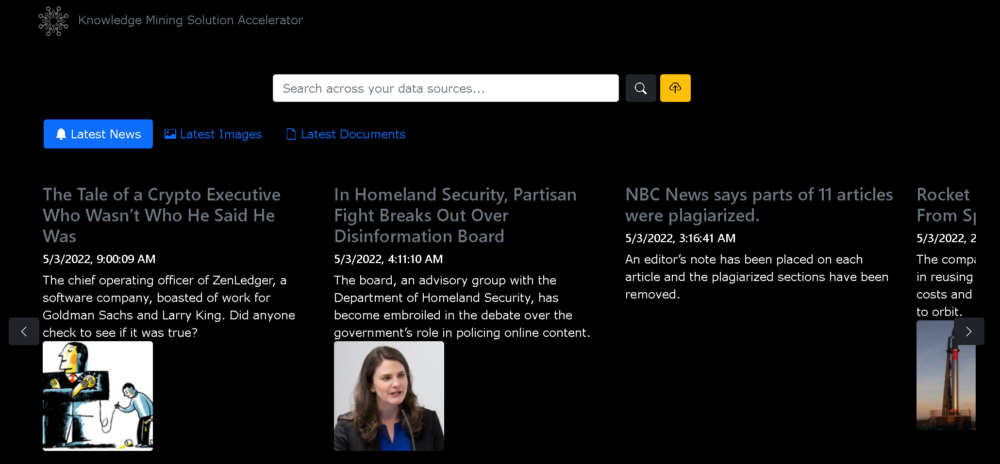


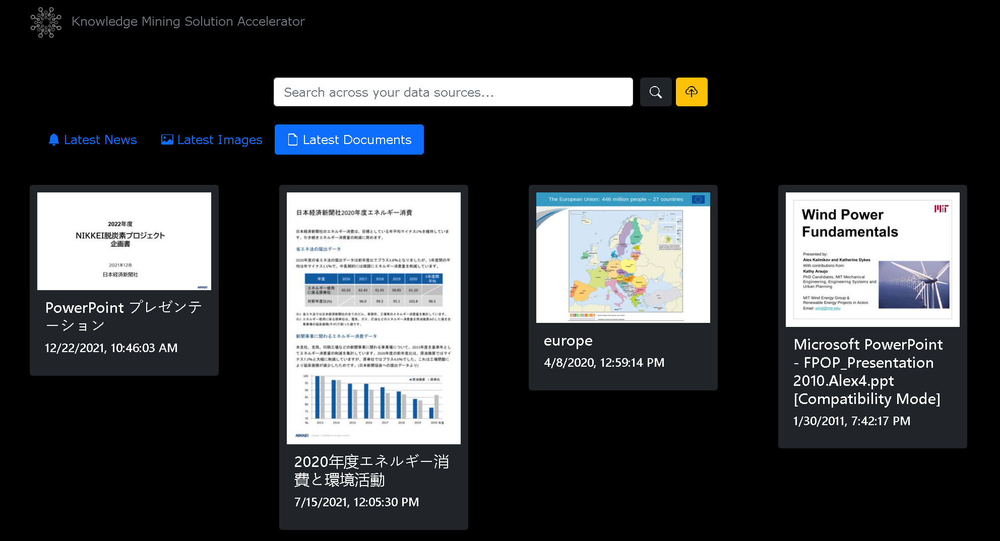

# Search Verticals 

## All
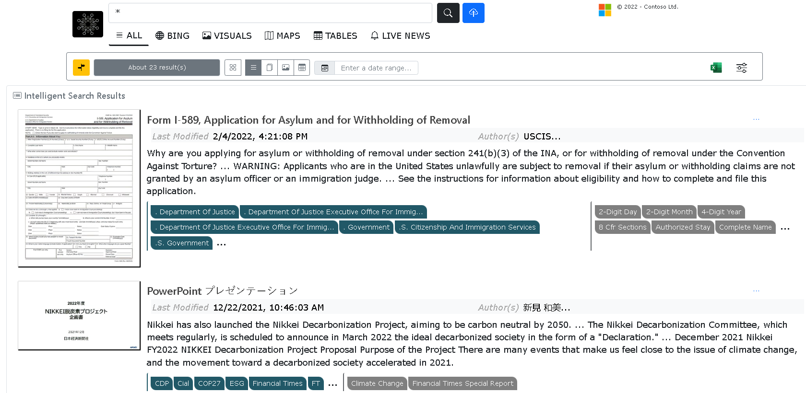

## News
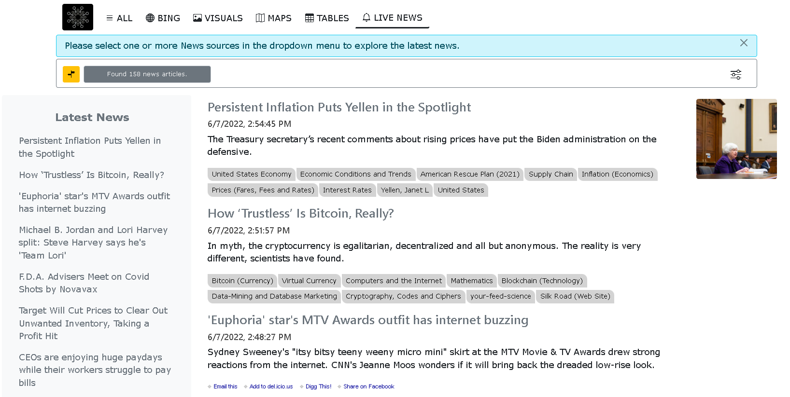

## Tables
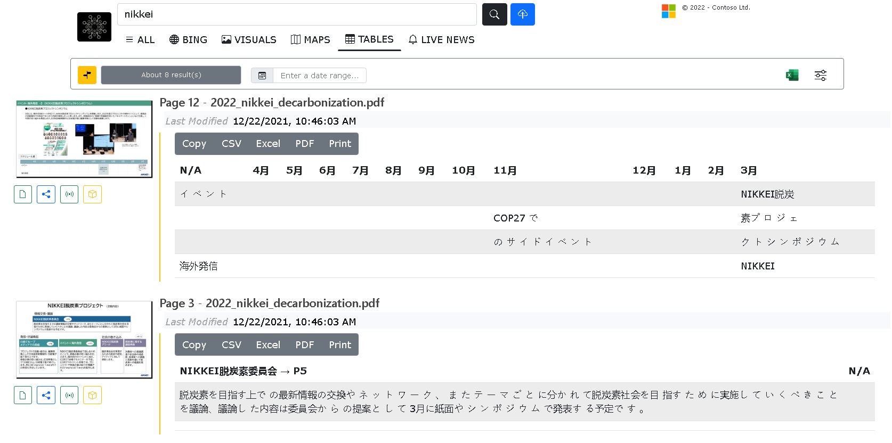

## Web/BING

**Note** This vertical use Bing Search API. For Production use, ensure you prominently include a functional hyperlink to the [Microsoft Privacy Statement](https://go.microsoft.com/fwlink/?LinkId=521839).

For more informations, https://docs.microsoft.com/en-us/bing/search-apis/bing-web-search/use-display-requirements

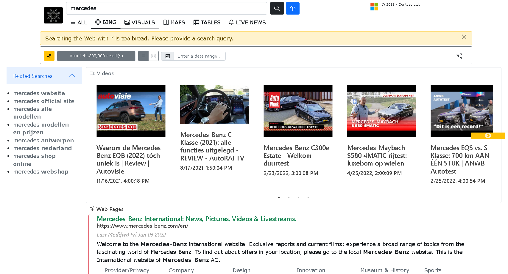

## Images/Visuals
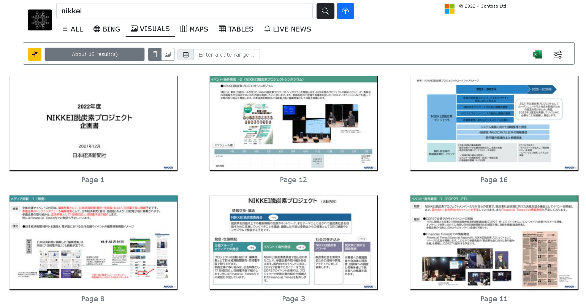

## Azure Maps 
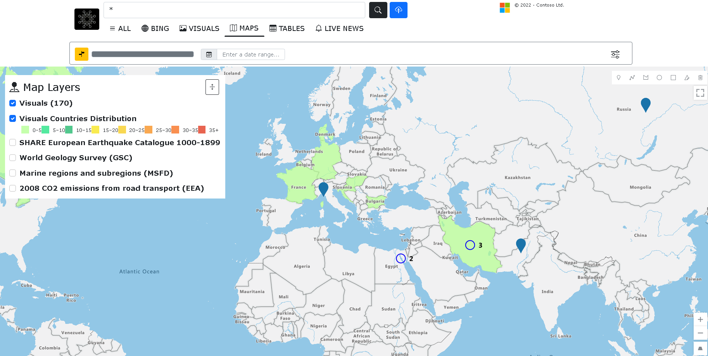

# Architecture 

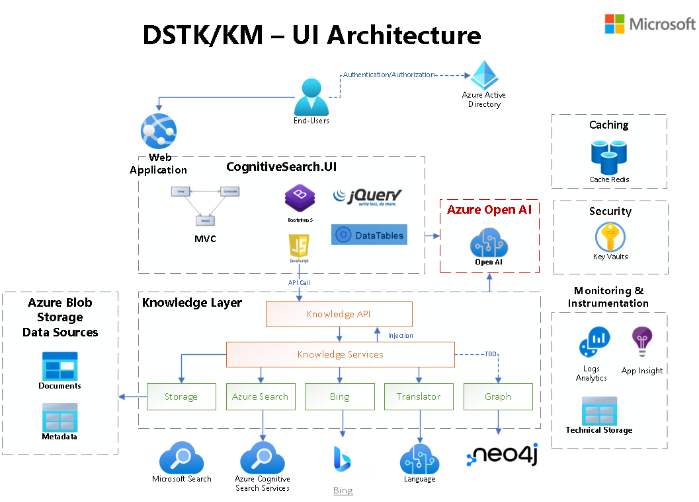

# Configuration

As mentioned earlier the UI is highgly configurable.  

config.json 

```json

```

## Landing Page 

The landing page is made of configurable Highlights/Insights structure. Each Insight is rendered as a tab, given your provide a method to invoke. 

Highlights is a sequence of sections, similar to the parallax layout.

```json
"LandingPage": {
    "pageTitle": "DataScience Toolkit",
    "path": "/Home/Search",
    "WebFacet": false,
    "Highlights": [
    {
        "id": "latest",
        "enable": true,
        "icon": "bi bi-bell-fill",
        "Insights": [
        {
            "id": "livenews",
            "enable": true,
            "title": "Latest News",
            "method": "Microsoft.News.FetchHomeNews",
            "icon": "bi bi-bell-fill"
        },
        {
            "id": "documents",
            "enable": true,
            "title": "Latest Documents",
            "method": "Microsoft.Home.GetLatestDocuments",
            "icon": "bi bi-file-earmark"
        },
        {
            "id": "images",
            "enable": true,
            "title": "Latest Visuals",
            "method": "Microsoft.Home.GetLatestImages",
            "icon": "bi bi-files"
        }
        ]
    }
    ],
    "Localizations": {
    "en": {
        "pageTitle": "Knowledge Mining",
        "name": "Knowledge Mining",
        "title": "Search across your data sources",
        "placeHolder": "Search across your data sources..."
    }
    }
},
```


## Search Vertical

```json
{
    "id": "search",
    "pageTitle": "Knowledge Mining - All",
    "name": "All",
    "title": "Search all data sources",
    "enable": true,
    "path": "/Home/Search",
    "searchMethod": "Microsoft.All.Search",
    "svgicon":"10834-icon-service-Search.svg",
    "placeHolder": "Explore all data...",
    "isSemanticCapable": true,
    "enableOffcanvasNavigation": true,
    "ResultsRenderings": [
        {
        "name": "allresults",
        "title": "Search documents",
        "fonticon": "bi bi-grid",
        "isdefault": true,
        "method": "Microsoft.All.UpdateResultsAsCard"
        },
        {
        "name": "blank"
        },
        {
        "name": "document",
        "title": "Only search documents",
        "fonticon": "bi bi-list",
        "method": "Microsoft.All.UpdateResultsAsList",
        "filter": "(document_embedded eq false)"
        },
        {
        "name": "pages",
        "title": "Only search document pages or slides",
        "fonticon": "bi bi-files",
        "method": "Microsoft.All.UpdateResultsAsCard",
        "filter": "(document_embedded eq true)"
        },
        {
        "name": "images",
        "title": "Only search Images",
        "fonticon": "bi bi-image",
        "method": "Microsoft.Images.UpdateImagesResults",
        "filter": "(document_embedded eq false and content_group eq 'Image')"
        },
        {
        "name": "tables",
        "title": "Only search extracted tables",
        "fonticon": "bi bi-table",
        "method": "Microsoft.Tables.UpdateTablesResults",
        "filter": "(tables_count ge 1)"
        }
    ]
}

```

## Navigation (Facets)

The default Navigation configuration is available across all verticals including Bing.

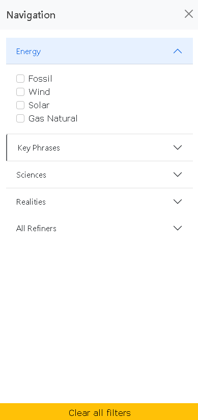

It is driven by a json configuration file (wwwroot/config/search-facets.json)

```json
[
  {
    "id": "energy",
    "name": "Energy",
    "type": "static",
    "target": "fulltext",
    "includeHomePage": true,
    "values": [
      {
        "value": "Fossil",
        "query": [ "Fossil Fuel", "Fossil Energy" ]
      },
      {
        "value": "Wind",
        "query": [ "Wind Farm", "Wind Turbine" ]
      },
      {
        "value": "Solar"
      },
      {
        "value": "Gas Natural"
      }
    ]
  },
  {
    "id": "keyphrases",
    "name": "Key Phrases",
    "type": "dynamic",
    "target": "key_phrases"
  },
  {
    "id": "sciencesstuff",
    "name": "Sciences",
    "type": "static",
    "target": "key_phrases",
    "includeHomePage": true,
    "values": [
      {
        "value": "Physical Geology"
      }
    ]
  },
  {
    "id": "xr",
    "name": "Realities",
    "type": "static",
    "target": "key_phrases",
    "includeHomePage": true,
    "values": [
      {
        "value": "Mixed Reality"
      },
      {
        "value": "Augmented Reality"
      },
      {
        "value": "Virtual Reality"
      }
    ]
  }
]
```

For the Live News, we use another configuration for navigration (wwwroot/config/news-facets.json)


```json
{
  "General News": [
    {
      "Id": "1",
      "Source": "NY Times",
      "URL": "https://www.nytimes.com/section/business",
      "Language": "English",
      "Country": "USA",
      "RSSFeedURL": "https://rss.nytimes.com/services/xml/rss/nyt/Business.xml",
      "includeHomePage": true
    },
    {
      "Id": "5",
      "Source": "CNN",
      "URL": "https://edition.cnn.com/",
      "Language": "English",
      "Country": "USA",
      "RSSFeedURL": "http://rss.cnn.com/rss/cnn_topstories.rss",
      "includeHomePage": false
    }
  ],
  "European Institutions": [
    {
      "Id": "6",
      "Source": "European Parlement",
      "URL": "https://www.europarl.europa.eu",
      "Language": "English",
      "Country": "Europe",
      "RSSFeedURL": "https://www.europarl.europa.eu/rss/doc/press-releases/en.xml",
      "includeHomePage": false
    }
  ],
  "Automotive News": [
    {
      "Id": "2",
      "Source": "Autonews",
      "URL": "https://www.autonews.com/",
      "Language": "English",
      "Country": "USA",
      "RSSFeedURL": "http://feeds.feedburner.com/autonews/BreakingNews",
      "includeHomePage": false
    }
  ]
}
```

## Search Navigation Concept

A concept here is to include static filters a solution might need to drive exploration on key topics. 

Dynamic filters are refiners in the classic Search world. They would include count and changed  
Static filters are simply 

# Search Filter 


The search filter is a single row container helping you accessing:
- Navigational 
- Search results count 
- Results Renderings
- Date filter 
- Applied filters
- Export to Excel
- Search Options

## Results Rendering 

You can configure the way results are rendered or filtered.  

```json
{
    "name": "allresults",
    "title": "Search documents",
    "fonticon": "bi bi-grid",
    "isdefault": true,
    "method": "Microsoft.All.UpdateResultsAsCard"
}
```

## Date Range filter 

Allow you to search documents/images,slides & pages based on their modified time. 

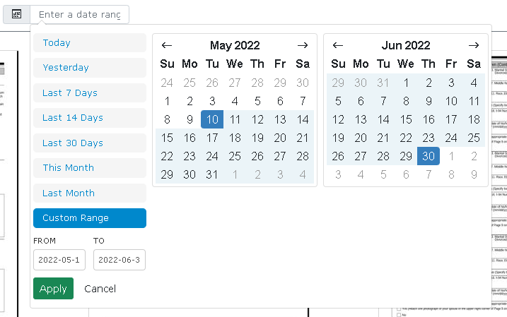

## Export to Excel (Experimental)

Work in progress to export search results as CSV for Excel import.

## Search Options 

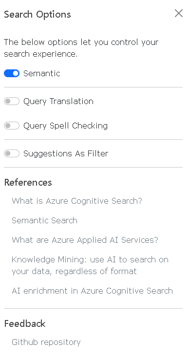

## Semantic Search 

Choose if you want your query to use the semantic search feature. 

[Learn about ACS Semantic Search](https://docs.microsoft.com/en-us/azure/search/semantic-search-overview)

|Feature|	Description|
|--|--|
|Semantic re-ranking|	Uses the context or semantic meaning of a query to compute a new relevance score over existing results.|
|Semantic captions and highlights|	Extracts sentences and phrases from a document that best summarize the content, with highlights over key passages for easy scanning. Captions that summarize a result are useful when individual content fields are too dense for the results page. Highlighted text elevates the most relevant terms and phrases so that users can quickly determine why a match was considered relevant.|
|Semantic answers|	An optional and additional substructure returned from a semantic query. It provides a direct answer to a query that looks like a question. It requires that a document have text with the characteristics of an answer.|

## Query Translation

When enabled, each search query is translated to English before being sent to ACS. The Translation service is enabled by default during the data enrichment phase of the indexing. 

## Query Spell Checking 

When the spellcheck service is enabled by config.BingSpellCheckEnabled, this feature will leverage Microsoft Bing to spell check your search query. 

Make sure to review [Microsoft Privacy Statement](https://go.microsoft.com/fwlink/?LinkId=521839)

## Suggestion as Filter 

This setting is linked to the search suggestions. Each suggestion has an associated entity (search field) like Key Phrases or Organizations. 

When enabled this setup will add the corresponding entity filter to the search query to restrict further potential matching documents or images. 

# Document Details 

Document details is a multitab panel to review a specific search results. 

## Preview 

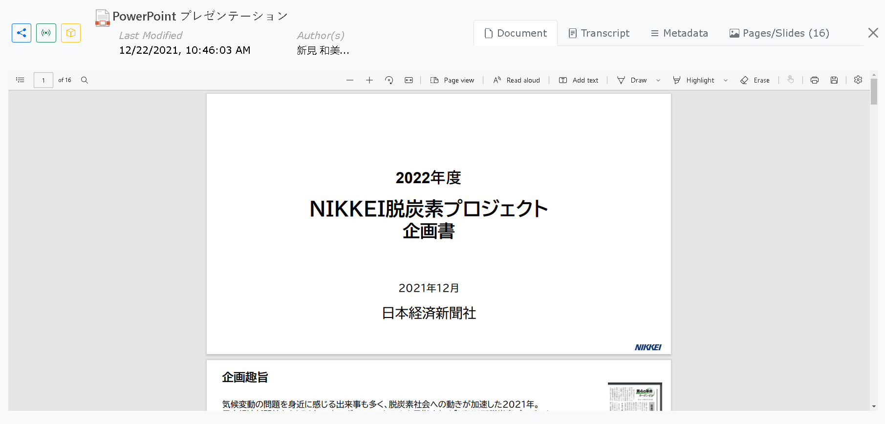

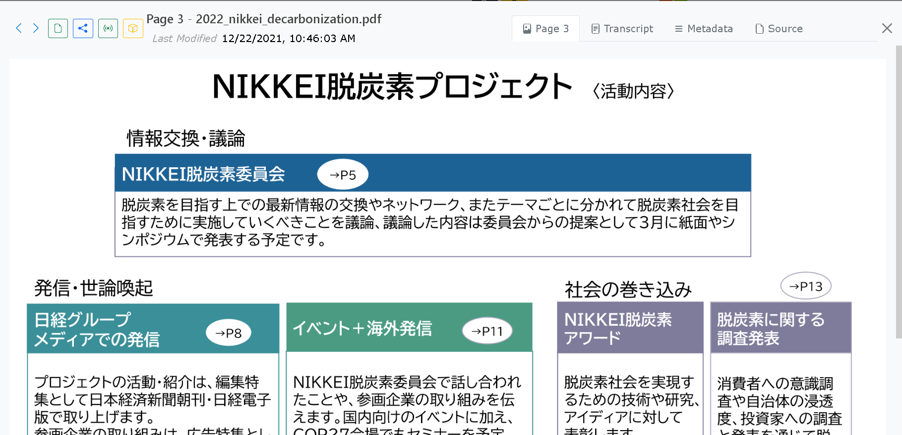

## Transcript

Full textual content extracted from the full document or as the result of an image OCR 

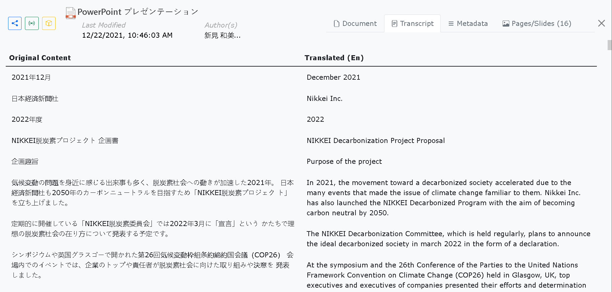

Side by side translation...

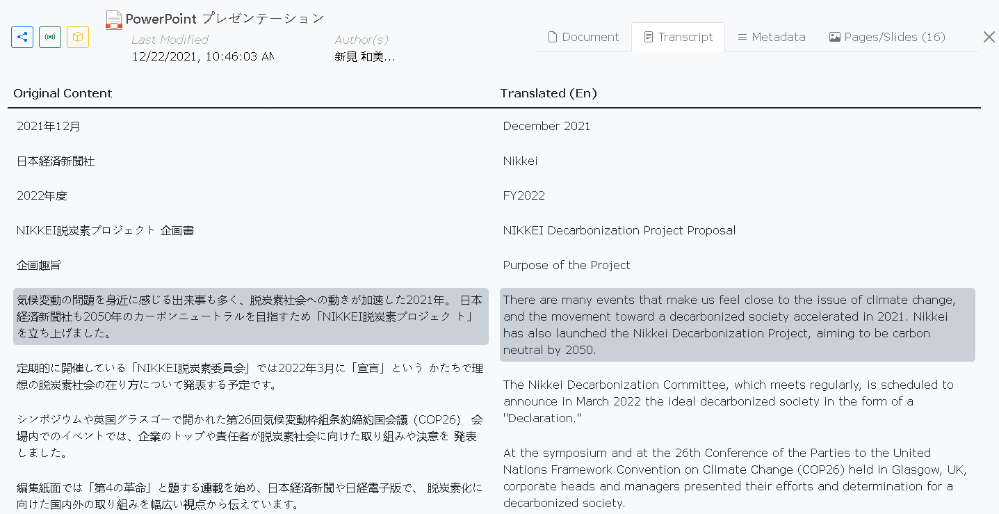

## Metadata 

The metadata presented here are indexed metadata. 

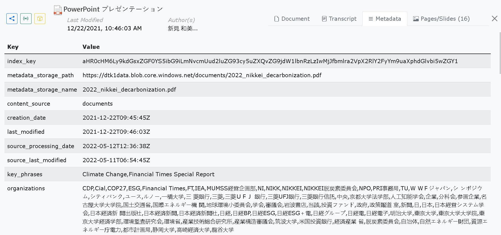

The Metadata tab will also fetch all File Data to allow you to review all existing metadata available for indexing. 

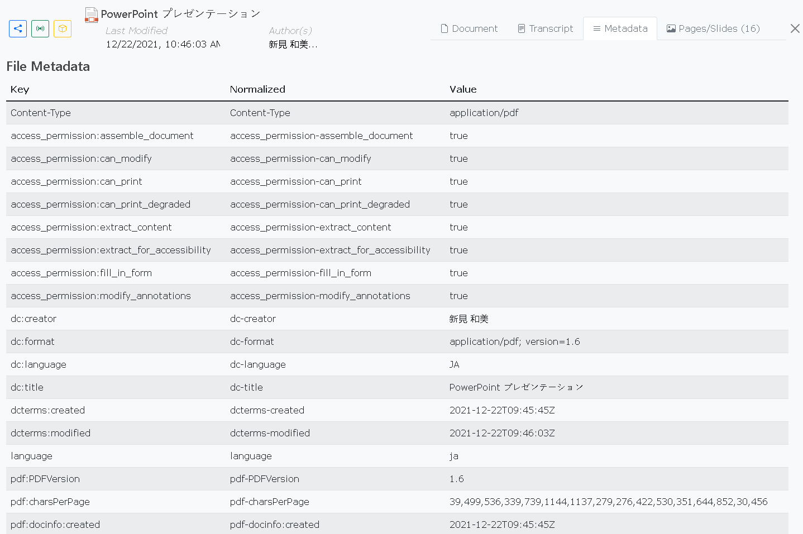

## Tables 

This panel will show all extracted tabular data of a page or slide. 

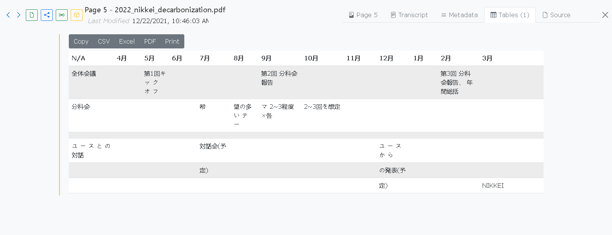

## Pages/Slides 

On a document, this panel will show the first 100 pages or slides in a thumbnail view. 

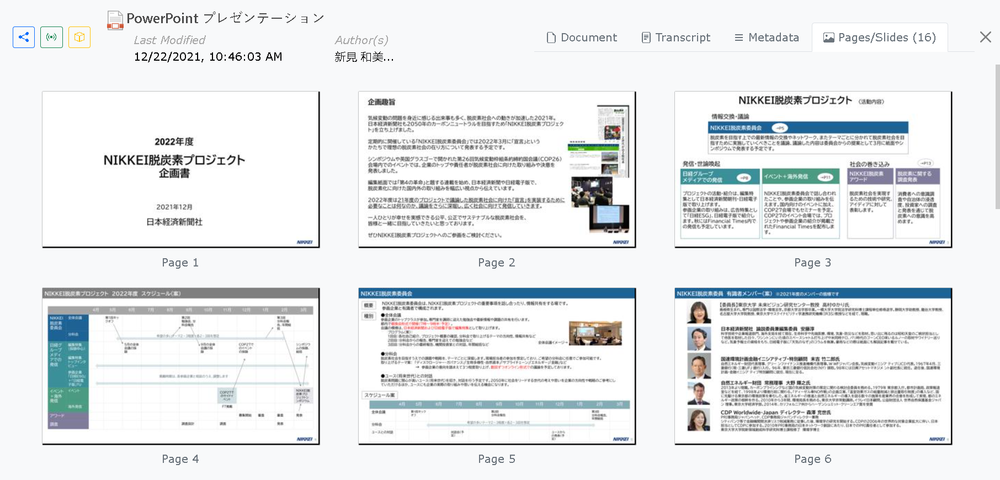

## Source 

Whe you are detailing a page or slide, the source will preview the parent document. 

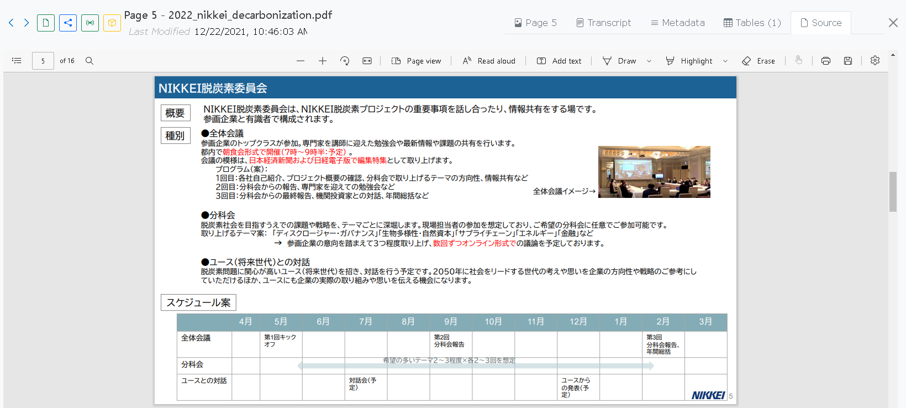
